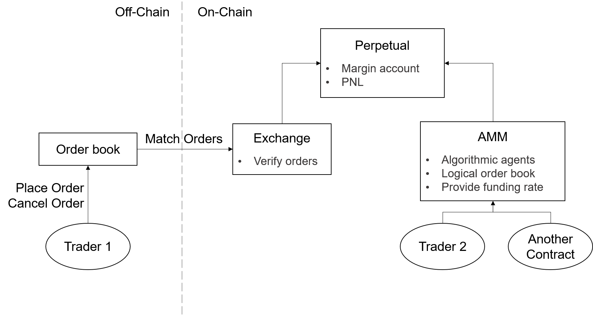
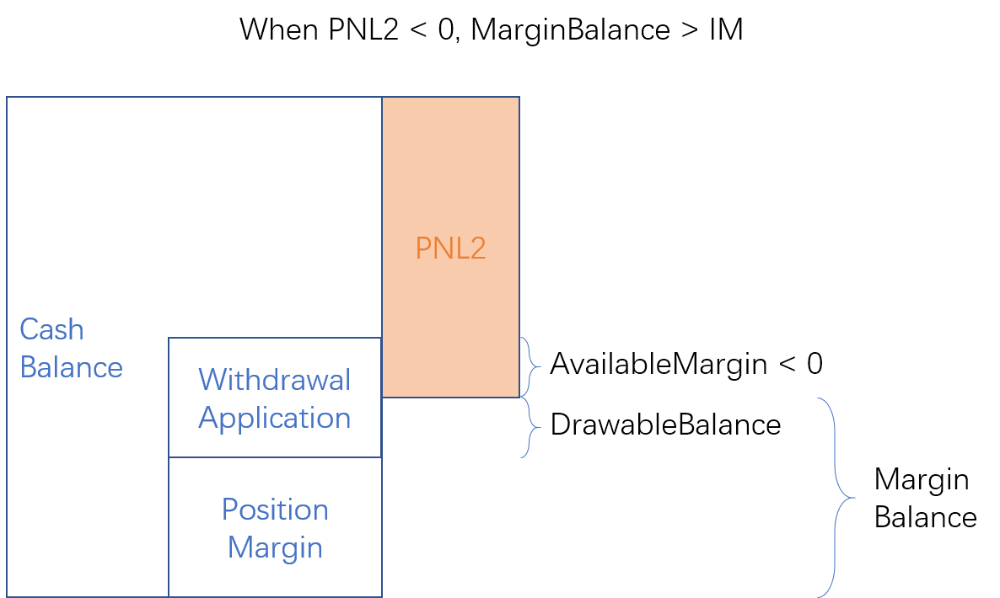
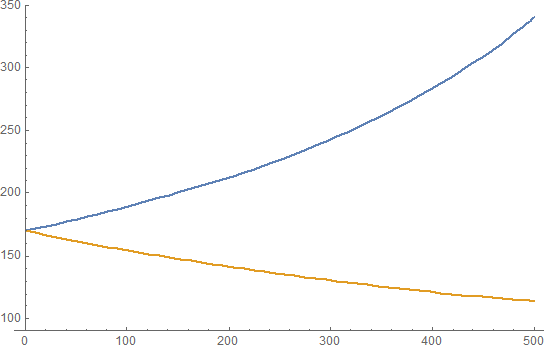

# Perpetual Technical Guidelines

This document focuses on some technical details, especially the formulas of the contract.

## Architecture

The Mai Protocol V2 is mainly composed of three parts: Perpetual, AMM and Exchange.
* Perpetual: Stores data of margin accounts including collaterals and positions
* AMM: Implements a Uniswap-like interface for user to directly interact with contract.
* Exchange: Implements "match" interface for order book trading, similar to what Mai protocol V1 achieved

This hybrid architecture is shown in the figure below:



As a decentralized exchange, we profoundly understand the importance of an on-chain trading interface, which means that anyone can call the interface function of the smart contract to trade without relying on any off-chain facilities. AMM provides the on-chain interface we are talking about.

The off-chain order book matching interface is a supplement to improve the user experience. Due to the current inefficiency of blockchain, the Hybrid model of off-chain matching and the on-chain transactions is one of the solutions to achieve efficiency.

Another key component is the decentralized oracle for obtaining the index price (spot price). After extensive research into decentralized oracle solutions, MCDEX team unanimously concluded that Chainlink's Price Reference Contracts are the best option in the market for sourcing and securing data. Chainlink already has an ETH/USD Price Reference Contract live on the Ethereum mainnet that is used and supported by several other top DeFi protocols. We are currently leveraging Chainlink's ETH/USD price feed as the index price for the ETH-PERP contract.


## Margin Account

Each trader has a margin account. A margin account consists of:
* Margin balance: Withdrawals and deposits are made in the margin balance. PNL will be automatically added to the margin balance.
* Position side: Can be long position or short position.
* Position size

**On-Chain part**

| Term | Definition |
|------|------------|
| CashBalance | Deposited collateral |
| MarginBalance | `CashBalance + PNL2` |
| PositionMargin | `MarkPrice * PositionSize * IMRate` |
| MaintenanceMargin | `MarkPrice * PositionSize * MMRate` |
| AvailableMargin | The balance that can open new positions = `MarginBalance - PositionMargin - WithdrawalApplicationAmount` |
| WithdrawableBalance | `MIN(MarginBalance - PositionMargin, WithdrawalApplicationAmount)` |
| IsSafe | `MarginBalance >= MaintenanceMargin` |
| PNL1 | Long position: `(MarkPrice - AvgEntryPrice) * PositionSize`<br>Short position: `(AvgEntryPrice - MarkPrice) * PositionSize` |
| PNL2 | `PNL1 - SocialLoss - FundingLoss` |
| WithdrawalApplicationAmount | Total number of withdrawal application submitted by the user |

**Off-Chain part**

| Term | Definition |
|------|------------|
| OrderMargin | `MarkPrice * OrderSize * IMRate` |
| AvailableBalance | `AvailableMargin - OrderMargin` |

**Example: PNL2 >= 0**


**Example: PNL2 < 0**




## How to Add Liquidity to AMM

This article details how to provide/remove liquidity to AMM.

Because MCDEX Perpetual is a [vanilla contract](en/perpetual#vanilla-amp-inverse-contract) on the blockchain, the discussion here takes vanilla contract as an example. Note that ETH-PERP appears as a corresponding inverse contract on the UI.

### Trade with AMM

As a market participant, AMM's behavior is similar to traditional market makers: AMM gives bid and ask prices, and traders buy/long or sell/short with AMM. MCDEX Perpetual AMM currently uses a constant product pricing model. This is a pricing model that has been fully validated in Uniswap.

Unlike traditional market makers, anyone can provide AMM with liquidity and increase AMM's market making depth by adding inventory to AMM. We call the person who provides liquidity to AMM a Liquidity Provider(LP). Liquidity Providers are exposed to risks when imbalanced between long and short, and obtain trade fee income.

### AMM's Margin Account

Like ordinary traders, AMM has a margin account. There are collateral and long position in this margin account, and the algorithm of AMM makes the effective leverage of its long position is always less than 1, which also means that AMM's margin account is always fully collateralized and will not be liquidated. The collateral and long position in this margin account are also called AMM's inventory.


We use `y` to represent the number of long position in AMM, then the **AMM's Available Margin** is expressed as `x`

```
x = Cash Balance - y * Entry Price
```

`Cash Balance` is the collateral that Liquidity Provider deposited. `Entry Price` is the average price of AMM entering the long position. The above formula guarantees that AMM position will always be fully collateralized. The cash balance minus the position occupancy is used as the available margin for AMM.

Why a long position can be kept fully collateralized: Taking ETH as an example, assuming the current price is p1, once the deposited collateral reaches p1, it is equivalent to having 1 ETH. If the price thereafter becomes p2, the PNL formula can guarantee that the collateral automatically becomes p2, which is still equivalent to 1 ETH. Sometimes people call this phenomenon as Synthetic Assets. Therefore, depositing (p1) + (1ETH) in the Uniswap formula can be equivalent to deposit (2 * p1) and get (p1) + (1 long position).

It is worth noting that the available margin calculated by the margin account at the initial margin rate is:

```
Margin Balance = Cash Balance + PNL
PNL = (Mark Price - Entry Price) * y, if y is long position
Available Margin = Margin Balance - y * Mark Price * Initial Margin > x
```

This means that the **AMM's Available Margin** is alway less than the **Account's Available Margin**.

x and y are also AMM inventory quantities. The pricing model requires that `x · y = k` remains unchanged before and after the transaction, and it can be concluded that the price of the transaction through AMM is:

```
The price to buy Δy contracts from AMM: P( Δy ) = x / ( y - Δy )
The price to sell Δy contracts to AMM: P( Δy ) = x / ( y + Δy )
```

When a trader goes long through AMM, the long position size of AMM (`y`) drops and the `AMM's Available Margin (x)` of will rise. This process consumes the long position inventory.

When a trader goes short through AMM, the long position size of AMM (`y`) rises and the `AMM's Available Margin (x)`will fall. This process consumes the AMM's available margin inventory.



(x-axis: Δy, y-axis: ask/bid price for a given amount.)

From the above pricing formula, it can be concluded that the pricing of AMM is only related to the inventory quantity `x` and `y` of AMM. When the product `k = x · y` is larger, the lower the slippage given by the pricing formula, resulting in a better liquidity. So adding liquidity to AMM means increasing the values ​​of `x` and `y`.

### Add liquidity to AMM

The liquidity provider increases AMM's liquidity by adding inventory to AMM, increasing the value of AMM inventory quantity `x` and `y`. The following process is completed in single contract call:

- Increase y: The Liquidity provider increases the number of AMM's long position (`y`) by `Δy`. To achieve this, the provider sells `Δy` contracts to AMM, at AMM's Mid Price (`x / y`).
- Increase x: The liquidity provider transfers the collateral tokens directly from their margin account to AMM's margin account, the amount transferred is `2 ∙ Δy ∙ x / y`. So `x` increases `Δy ∙ x / y`

The collateral transferred to AMM is divided into two equal parts, one part is used for the margin occupied by the new position of AMM, and the other part is used to increase the `AMM's Available Margin`. It can be proved that after increasing the liquidity, AMM's `Mid Price = x / y` remains unchanged.

After adding liquidity, the provider will get AMM share tokens according to the amount of the inventory provided. Share tokens represent ownership of the remaining inventory in the liquidity pool.

When remove liquidity of AMM, the liquidity provider can obtain the inventory in the liquidity pool (including the long position and cash balance) in proportion to the share tokens by redeeming the share tokens.

Keep in mind that the ratio of new and old x, y, share is always the same when adding and removing liquidity:

```
 x     y     share
--- = --- = -------
 x'    y'    share'
```

It should be noted that since the provider sells contracts to AMM when adding liquidity, the position size of the provider will decrease. If the liquidity provider has no position before the operation, the position size in of the provider will become negative after the operation. On the other hand, due to the need to transfer collateral from the liquidity provider’s margin account to AMM's, if the provider originally has a position, the effective leverage of the position will normally increase due to the decrease of margin balance.


`Example 1` Adds 1 contract liquidity if Alice has 0 position

<table>
<thead>
<tr>
    <th></th>
    <th colspan="3">Alice's margin account</th>
    <th colspan="3">AMM's margin account</th>
</tr>
</thead>
<tbody>
<tr>
    <th></th>
    <th>Position Size</th>
    <th>Margin Balance</th>
    <th>Share Ratio</th>
    <th>Position Size(y)</th>
    <th>AMM's Available Margin(x)</th>
    <th>Mid Price(x/y)</th>
</tr>
<tr>
    <td align="center">Before</td>
    <td align="center">0</td>
    <td align="center">50</td>
    <td align="center">0/10</td>
    <td align="center">10</td>
    <td align="center">100</td>
    <td align="center">10</td>
</tr>
<tr>
    <td align="center">After</td>
    <td align="center">-1</td>
    <td align="center">30</td>
    <td align="center">1/11</td>
    <td align="center">11</td>
    <td align="center">110</td>
    <td align="center">10</td>
</tr>
</tbody>
</table>

Alice adds 1 contract liquidity to AMM:

1. Alice sells one contract to AMM at mid-price 10, then Alice's position size becomes -1 and AMM's position size becomes 11.
2. Alice transfers 10 * 1 * 2 = 20 collateral tokens to AMM. This 20 goes into the `Cash Balance`, where 10 is occupied by the newly added `y`, so `x` increases by 10.

`Example 2` Adds 1 contract liquidity if Alice already has 1 long position

<table>
<thead>
<tr>
    <th></th>
    <th colspan="3">Alice's margin account</th>
    <th colspan="3">AMM's margin account</th>
</tr>
</thead>
<tbody>
<tr>
    <th></th>
    <th>Position Size</th>
    <th>Margin Balance</th>
    <th>Share Ratio</th>
    <th>Position Size(y)</th>
    <th>AMM's Available Margin(x)</th>
    <th>Mid Price(x/y)</th>
</tr>
<tr>
    <td align="center">Before</td>
    <td align="center">1</td>
    <td align="center">50</td>
    <td align="center">0/10</td>
    <td align="center">10</td>
    <td align="center">100</td>
    <td align="center">10</td>
</tr>
<tr>
    <td align="center">After</td>
    <td align="center">0</td>
    <td align="center">30</td>
    <td align="center">1/11</td>
    <td align="center">11</td>
    <td align="center">110</td>
    <td align="center">10</td>
</tr>
</tbody>
</table>

Alice adds 1 contract liquidity to AMM:

1. Alice sells one contract to AMM at mid-price 10, then Alice's position size becomes 0 and AMM's position size becomes 11.
2. Alice transfers 10 * 1 * 2 = 20 collateral tokens to AMM

In this example, Alice had a long position at the beginning. After the adding operation, Alice has no position. This means Alice transferred her position to AMM.

`Example 3` Adds 1 contract liquidity if Alice already has 1 short position


<table>
<thead>
<tr>
    <th></th>
    <th colspan="3">Alice's margin account</th>
    <th colspan="3">AMM's margin account</th>
</tr>
</thead>
<tbody>
<tr>
    <th></th>
    <th>Position Size</th>
    <th>Margin Balance</th>
    <th>Share Ratio</th>
    <th>Position Size(y)</th>
    <th>AMM's Available Margin(x)</th>
    <th>Mid Price(x/y)</th>
</tr>
<tr>
    <td align="center">Before</td>
    <td align="center">-1</td>
    <td align="center">50</td>
    <td align="center">0</td>
    <td align="center">10</td>
    <td align="center">100</td>
    <td align="center">10</td>
</tr>
<tr>
    <td align="center">After</td>
    <td align="center">-2</td>
    <td align="center">30</td>
    <td align="center">1/11</td>
    <td align="center">11</td>
    <td align="center">110</td>
    <td align="center">10</td>
</tr>
</tbody>
</table>

Alice adds 1 contract liquidity to AMM::

1. Alice sells one contract to AMM at mid-price 10, then Alice's position size becomes -2 and AMM's position size becomes 11.
2. Alice transfers 10 * 1 * 2 = 20 collateral tokens to AMM

In this example, Alice had a short position at the beginning. After the addition operation, Alice's short position further increases.

### Risk exposure and Revenues

Simply providing liquidity to AMM does not increase the risk exposure of providers. This is because the short position caused by the adding operation is exactly equal to the AMM's long position attributable to the provider. For example, the above `Example 1`, when the adding operation is completed, AMM situation is as follows:

<table>
<thead>
<tr>
    <th></th>
    <th colspan="3">Alice's margin account</th>
    <th colspan="3">AMM's margin account</th>
    <th colspan="2">Attributable to Alice&ast;&ast;</th>
</tr>
</thead>
<tbody>
<tr>
    <th></th>
    <th>Position Size</th>
    <th>Margin Balance</th>
    <th>Share Ratio</th>
    <th>Position Size (y)</th>
    <th>AMM's Available Margin (x)</th>
    <th>Mid Price (x/y)</th>
    <th>Position</th>
    <th>Collateral</th>
</tr>
<tr>
    <td align="center">Before add</td>
    <td align="center">0</td>
    <td align="center">50</td>
    <td align="center">0</td>
    <td align="center">10</td>
    <td align="center">100</td>
    <td align="center">10</td>
    <td align="center">0</td>
    <td align="center">0</td>
</tr>
<tr>
    <td align="center">After add</td>
    <td align="center">-1</td>
    <td align="center">30</td>
    <td align="center">1/11</td>
    <td align="center">11</td>
    <td align="center">110</td>
    <td align="center">10</td>
    <td align="center">1</td>
    <td align="center">20</td>
</tr>
</tbody>
</table>

&ast;&ast; Position attributable to Alice = y * share ratio<br>
&ast;&ast; Collateral attributable to Alice = 2 * x * share ratio

Alice's overall balance:

|Overall Position| Overall Margin Balance|
|:------:|:---------:|
| -1 + 1 = 0 |  30 + 20 = 50  |

The overall balance is consistent with Alice’s origin margin account. It shows that providing liquidity to AMM only means transfering the provider's inventory to AMM's margin account.

When other traders trade with AMM, it will change AMM's long position size `y`, and change the amount of long position attributable to Alice in AMM. At this time, Alice's overall position size is no longer 0, and Alice has risk exposure.

`Example` Bob buy 1 contract from AMM at the price `p = 110 / (11 - 1) = 11`, (ignore the trading fee).

```
y' = y - 1 = 10
x' = x * y / y' = 110 * 11 / 10 = 121
```

The situation of AMM after the trade is as follows:

<table>
<thead>
<tr>
    <th></th>
    <th colspan="3">Alice's margin account</th>
    <th colspan="3">AMM's margin account</th>
    <th colspan="2">Attributable to Alice</th>
</tr>
</thead>
<tbody>
<tr>
    <th></th>
    <th>Position Size</th>
    <th>Margin Balance</th>
    <th>Share Ratio</th>
    <th>Position Size (y)</th>
    <th>AMM's Available Margin (x)</th>
    <th>Mid Price (x/y)</th>
    <th>Position</th>
    <th>Margin balance</th>
</tr>
<tr>
    <td align="center">Before Bob</td>
    <td align="center">-1</td>
    <td align="center">30</td>
    <td align="center">1/11</td>
    <td align="center">11</td>
    <td align="center">110</td>
    <td align="center">10</td>
    <td align="center">11/11</td>
    <td align="center">220/11</td>
</tr>
<tr>
    <td align="center">After Bob</td>
    <td align="center">-1</td>
    <td align="center">30</td>
    <td align="center">1/11</td>
    <td align="center">10</td>
    <td align="center">121</td>
    <td align="center">12.1</td>
    <td align="center">10/11</td>
    <td align="center">242/11</td>
</tr>
</tbody>
</table>

At this time, Alice's overall position size is `-1 + 10/11 = -0.0909`, which is NOT 0. As a result, Alice has the risk exposure of -0.0909 contract until another trader sell 1 contract to AMM.

The upper limit of the provider's risk exposure is the quantity x and y of the inventory he/her adds to the AMM. In practice, the provider can monitor the status of AMM. When risk exposure occurs, the provider can hedge the risk exposure on other exchanges to maintain risk neutrality.

What's more, when a trader trades with AMM, he needs to pay an additional 0.075% transaction fee, of which 0.06% will enter the AMM's margin account, increasing the AMM margin balance. As the provider has a share of the margin balance, the margin balance attributable to the provider rises consequently. When the provider removes liquidity from AMM, the provider can obtain the fee in proportion to the share. The fee is an incentive for liquidity providers.

If the liquidity provider fully hedges its risk exposure, it can greatly reduce the risk and obtain a relatively stable fee income. On the other hand, there is also a premium/discount between the AMM price and other exchanges' prices, and the provider can also arbitrage meanwhile hedging. 
 
Finally, in addition to the profit and loss caused by price fluctuations, the position of perpetual contracts also has the profit and loss caused by funding. Liquidity providers also need to consider the problem of funding according to specific strategies. In short, the strategies of liquidity providers to AMM can be very rich.

### Remove Liquidity from AMM

The liquidity provider can withdraw its share in the pool at any time. When remove liquidity, the following operations occur simultaneously:

1. AMM transfers the margin balance attributable to the provider.
2. The provider buys contracts from AMM at the middle price `x / y`. The trade amount is equal to the long position size attributable to the provider in AMM.

`Example 1` followed by Example 1 of "Add Liquidity to AMM", if Alice remove liquidity at this time, Alice's share was 1 / 11, we first calculate how many positions Alice needs to trade after consuming all shares.

```
Amount = y * (ShareAmount / TotalSupply) = 1
Price = x / y = 10
```

Alice will:
1. Buys amount = 1 at price = 10
2. Receives collateral:

```
Collateral = 2 * Price * Amount = 20
```

The total shares will be 10 from 11, satisfy:

```
 x = 110     y = 11     share = 11
--------- = -------- = ------------ ∴ x' = 100, y' = 10
    x'         y'       share' = 10
```

<table>
<thead>
<tr>
    <th></th>
    <th colspan="3">Alice's margin account</th>
    <th colspan="3">AMM's margin account</th>
</tr>
</thead>
<tbody>
<tr>
    <th></th>
    <th>Position Size</th>
    <th>Margin Balance</th>
    <th>Share Ratio</th>
    <th>Position Size(y)</th>
    <th>AMM's Available Margin(x)</th>
    <th>Mid Price(x/y)</th>
</tr>
<tr>
    <td align="center">Before add</td>
    <td align="center">0</td>
    <td align="center">50</td>
    <td align="center">0/10</td>
    <td align="center">10</td>
    <td align="center">100</td>
    <td align="center">10</td>
</tr>
<tr>
    <td align="center">After add</td>
    <td align="center">-1</td>
    <td align="center">30</td>
    <td align="center">1/11</td>
    <td align="center">11</td>
    <td align="center">110</td>
    <td align="center">10</td>
</tr>
<tr>
    <td align="center">After remove</td>
    <td align="center">0</td>
    <td align="center">50</td>
    <td align="center">0/10</td>
    <td align="center">10</td>
    <td align="center">100</td>
    <td align="center">10</td>
</tr>
</tbody>
</table>

This is equivalent to reverting to Alice's original state.

`Example 2` followed by the example in "Risk Exposure and Revenue", if Alice removes liquidity after Bob's transaction is completed, Alice's share was 1 / 11, we first calculate how many positions Alice needs to trade after consuming all shares.

```
Amount = y * (ShareAmount / TotalSupply) = 0.909
Price = x / y = 12.1
```

Alice will:
1. Buys amount = 0.909 at price = 12.1
```
PNL = (EntryPrice - ExitPrice) * Amount = (10 - 12.1) * 0.909 = -1.909. This is PNL formula for short position
```
2. Receives collateral:
```
RemovedCollateral = 2 * Price * Amount = 22
```

The total shares will be 10 from 11, satisfy:

```
 x = 121     y = 10     share = 11
--------- = -------- = ------------ ∴ x' = 110, y' = 9.09
    x'         y'       share' = 10
```

<table>
<thead>
<tr>
    <th></th>
    <th colspan="3">Alice's margin account</th>
    <th colspan="3">AMM's margin account</th>
    <th colspan="2">Attributable to Alice</th>
</tr>
</thead>
<tbody>
<tr>
    <th></th>
    <th>Position Size</th>
    <th>Margin Balance</th>
    <th>Share Ratio</th>
    <th>Position Size (y)</th>
    <th>AMM's Available Margin (x)</th>
    <th>Mid Price (x/y)</th>
    <th>Position</th>
    <th>Margin balance</th>
</tr>
<tr>
    <td align="center">Before Bob</td>
    <td align="center">-1</td>
    <td align="center">30</td>
    <td align="center">1/11</td>
    <td align="center">11</td>
    <td align="center">110</td>
    <td align="center">10</td>
    <td align="center">11/11</td>
    <td align="center">220/11</td>
</tr>
<tr>
    <td align="center">After Bob</td>
    <td align="center">-1</td>
    <td align="center">30</td>
    <td align="center">1/11</td>
    <td align="center">10</td>
    <td align="center">121</td>
    <td align="center">12.1</td>
    <td align="center">10/11</td>
    <td align="center">242/11</td>
</tr>
<tr>
    <td align="center">After Remove</td>
    <td align="center">-0.091</td>
    <td align="center">50.091</td>
    <td align="center">0/10</td>
    <td align="center">9.09</td>
    <td align="center">110</td>
    <td align="center">12.1</td>
    <td align="center">0</td>
    <td align="center">0</td>
</tr>
</tbody>
</table>

It is showed that due to Bob's transaction, Alice has a risk exposure of -0.091 contracts. This risk exposure still exists after removing liquidity, which means that removing liquidity does not change the provider's risk exposure. The provider can eliminate the risk exposure by closing the position later.


## Contract Architecture

The Mai Protocol V2 is mainly composed of three parts: Perpetual, AMM and Exchange. The Perpetual contract stores data of margin accounts including collaterals and positions. The Exchange contract implements "match" interface for order book trading, similar to what Mai protocol V1 achieved. The AMM contract implements a Uniswap-like interface for user to directly interact with contract.

### Perpetual

Perpetual is the core of Mai Protocol V2 protocol. As mentioned above, it holds all assets owned by user, providing interfaces to manipulate balance and position. One Perpetual contract is exactly serving for one trading pair.

All assets of a trader are stored in his margin account, which contains a collateral account, a position account and its current broker, identified by user's ethereum address. Margin accounts are isolated between different perpetuals.

Every trader has to deposit before interacting with Exchange or AMM contract. Trades within system doesn't trigger real eth/erc20 transfer, but update the balance in their margin accounts.

#### Collateral.sol

This contract provides low-layer functions of dealing with collaterals. The balance of an account may be affected both by depositing and PNL (Profit-and-Loss) made from position trading.

Note that deposited collateral is converted to a internal decimals presentation (default: fix float number with decimals == 18) then added to balance field.

*In some of our documents, we call balance in collateral account as cash balance to distinguish from erc20 token balance.*

#### Position.sol

Similar to collateral account, this contract maintains position account for each trader and contains all position calculators required from the upper-layer contract.

#### Brokerage.sol

Broker contract implements a delayed broker setter to protect orderbook trading from front running.

#### PerpetualGovernance.sol

The governance contract holds all parameters required for running a perpetual contract, including risk parameters, addresses, and status.

Check design of perpetual for their details.

#### Perpetual.sol

This contract is the core of Mai Protocal V2. It combines all components above, serving as the foundation of Exchange and AMM.

Calculation taking price as parameter reads price from AMM contract.

### Exchange

Exchange focuses on matching off-chain order for traders. It matches orders between trader (known as maker and taker), or trader and AMM.

A taker cannot match with makers and AMM at the same time.

#### Exchange.sol

Exchange contract implements methods exchanging between traders or between trader and AMM.

Calling match method currently requires a caller as broker.

### AMM

AMM provides methods to add / remove liquidity and trading without order book. It can be easily called from other contract to build new DAPP.

AMM is designed to be an upgradable contract to adapt algorithm update. Since all assets are actually stored in perpetual contract, the upgrade progress could be smooth and lossless.

#### AMM.sol

This contract serves three purpose: Uniswap-like trading, liquidation providing and funding rate calculation.

Traders could trade through buy/sell methods, with limited price and deadline or provide liquidation to contract to earn trading fee.

See design of AMM for more details of providing liquidation.

#### AMMGovernance.sol

All parameters required by AMM goes here.

### Others

#### GlobalConfig.sol

Global config is a simple contract only used to set block delay of withdrawal and broker update.

See "Broker & Withdraw Time Lock" section in the [references page](/en/perpetual#broker-amp-withdraw-time-lock) for the design of time lock.

#### PerpetualProxy.sol

To implement an upgradable AMM, the address of new AMM should alway stay the same to inherit assets from former one.

This contract plays as the role of address holder for AMM contract.


## Contract Interfaces

### Perpetual

**Interact with collaterals (cash balance):**

```javascript
getCashBalance(address guy)
```

Return cash balance storage variables of guy, which is defined as:

```javascript
struct CollateralAccount {
    // current deposited erc20 token amount, representing in decimals 18
    int256 balance;
    // the amount of withdrawal applied by user
    // which allowed to withdraw in the future but not available in trading
    int256 appliedBalance;
    // applied balance will be applied only when the block height below is reached
    uint256 appliedHeight;
}
```

See "Broker & Withdraw Time Lock" section in the [references page](en/perpetual#trade-with-the-order-book) for the design of time lock.

```javascript
deposit(uint256 amount) NORMAL
```
Deposit transfer collaterals from caller's address to contract. It accept an amount parameter which indicates the total amount of collaterals that user wants to transfer to contract.
Approval is required;

**amount should be a fixed float with token's decimals which will be convert to a decimals-18 representation. E.G. Jim deposits 1e6 USDT, later he will found 1e18 collaterals in his account of Mai protocol v2. This only affects internal calculation*

```javascript
depositEther() NORMAL
```

Ether version of deposit, using msg.value instead. See description above for details. When using ether, the decimals will be automatically set to 18.

```javascript
applyForWithdrawal(uint256 amount) NORMAL
```

Request for further withdrawal of caller's account. This method functions like approve of erc20. Trader could apply for the amount that far greater than actual balance he owned, but applied part is no longer available for position trading.

```javascript
withdraw(uint256 amount) NORMAL
```

Withdraw given amount collateral back to caller's ethereum address. Note that withdraw doesn't distinguish between erc20 and ether.

```javascript
settle() SETTLED
```

Settle is a special version of withdraw which is only available when global settlement is done. It will close all opened position of caller then drain the remaining collaterals to caller.

Settle can be call multiple times but only the first successful call will actually do the job.


```javascript
depositToInsuranceFund(uint256 amount)
depositEtherToInsuranceFund()
```

Deposit collaterals from caller's address to contract. The funds will not go to any account but recorded by an variable in perpetual.

-----

**Interact with positions:**

There do exists interface to manipulate position and collateral for trading purpose, but basically the perpetual contract does not directly handle trading request from user. It only provider interfaces for whitelisted callers like **exchange** and **amm** contract.

Calling trade method of perpetual may break constraints that long position should always equals to short positions.

The only interface available to a typical trader is:

```javascript
getPosition(address guy)
```

Return position storage variables of guy, which is defined as:

```javascript
struct PositionAccount {
    LibTypes.Side side;
    uint256 size;
    uint256 entryValue;
    int256 entrySocialLoss;
    int256 entryFundingLoss;
}
```

```javascript
totalSize(Side side)
```

Return total size of positions. Side has 3 available value: FLAT(0), SHORT(1) and LONG(2).

*The constraint is that totalSize(SHORT) should always be equal to totalSize(LONG) and totalSize(FLAT) should always be zero.*

```javascript
socialLossPerContract(Side side)
```

Return social loss per contract of given side. Normally, the value of each side should never decrease.

```javascript
positionMargin(address guy)
```

Methods of calculating position value requires mark price from amm contract. This price will be replaced by settlement price set by administrator in settlement status (SETTLING, SETTLED).

```javascript
maintenanceMargin(address guy)
```

Return maintenance margin value of account base on current mark price. The value should always be lower than initial margin value.

If the current value of positions falls below maintenance margin, the account will go into a status called 'unsafe'. An unsafe account can be liquidated by any trader within the same perpetual to prevent possible loss.

When the value falls below zero, the account is 'bankrupt'.

```javascript
pnl(address guy)
```

Return profit and loss of account base on current mark price. This value would be added to balance on remargin, which is usually happens on withdrawal and settlement.

```javascript
availableMargin(address guy)
```

Return available margin of account base on current mark price.

The pnl is already included.

```javascript
drawableBalance(address guy)
```

Return drawable balance of account base on current mark price. Trader could get balance through apply-withdraw progress.

The pnl is already included.

```javascript
isIMSafe(address guy)       // is initial margin safe.
isSafe(address guy)         // is maintainance margin safe;
isBankrupt(address guy)
```

These three test method is used to test current status of an account.

```javascript
insuranceFundBalance()
```

Insurance fund is claimed from liquidation penalty and will be used to recover social loss.


```soldiity
liquidate(address guy, uint256 maxAmount) public returns (uint256, uint256) NORMAL SETTLING
```

Liquidate bites a part of position from an unsafe account (See isSafe for definition of unsafe) to make it safe again. The call should have enough margin to hold the bitten positions or the call will fail.

All losses generated by liquidate will be removed from insurance fund first if possible, or the loss will become social loss.

-----

**Interact with brokers:**

Broker is a actor who helps trader to accomplish orderbook trading. Broker is set by trader, with a few blocks delay.

To receive trading fee, a broker must assign positive maker/taker fee rate in order data structure. And if given a negative trading fee, the broker will pay trader for making / taking order.

There are two typically value of broker:

- broker is set to a contract call who calls match method of exchange methods (orderbook trading);
- broker is set to address of amm (perpetual proxy actually) to enable amm trading.

Trader cannot apply both the trading modes above since the broker variable can hold exactly one address at the same time.

There is a delay mechanism on setting broker address, see "Broker & Withdraw Time Lock" section in the [references page](/en/perpetual#broker-amp-withdraw-time-lock) for the design of time lock.

Perpetual contract provider interface of setting brokers, but the applying delay is determined by global config.

```javascript
currentBroker(address trader)
```

Return current broker's address of given trader address. If last setting is not applied, this function will return last applied broker address.


```javascript
setBroker(address broker)
```

Set caller's broker to given account.

```javascript
getBroker(address trader)
```

Return broker storage of given account. For normal case, trader should call currentBroker instead.


### Exchange

Exchange protocol dose exchange between one taker and some makers. Traders sign for their order content and another actor named broker call match method for them, claiming trading fee from both side.

```javascript
struct OrderParam {
    address trader;
    uint256 amount;
    uint256 price;
    bytes32 data;
    OrderSignature signature;
}

struct Order {
    address trader;
    address broker;
    address perpetual;
    uint256 amount;
    uint256 price;
    bytes32 data;
}

matchOrders(
    OrderParam memory takerOrderParam,
    OrderParam[] memory makerOrderParams,
    address perpetual,
    uint256[] memory amounts
)
```

Length of parameter 'amounts' should equal to the length of 'makerOrderParams'.

The matchOrders methods will try to match order from taker with each order from makers. If matched, taker will receive positions from maker, and collateral is paid to maker at the price maker asking for. Matched amount is exactly the same  as the amount in parameter 'amounts'.

Some properties is encoded into data field:

| Name           | Length (bytes) | Description                                                  |
| -------------- | -------------- | ------------------------------------------------------------ |
| Version        | 1              | supported protocol version. 1 = Mai Protocol V1, 2 = Mai Protocol V2 |
| Side           | 1              | Side of order. 1 = short, other = long                       |
| isMarketOrder  | 1              | 0 = limit order, 1 = market order                            |
| expiredAt      | 5              | order expiration time in seconds                             |
| asMakerFeeRate | 2              | (int16) maker fee rate (base 100,000)                        |
| asTakerFeeRate | 2              | (int16) taker fee rate (base 100,000)                        |
| deprecated     | 2              |                                                              |
| salt           | 8              | salt                                                         |
| isMakerOnly    | 1              | is maker only order                                          |
| isInversed     | 1              | is for inversed contract. if true, price and side will be inversed in matching |
| reserved       | 8              |                                                              |


```javascript
matchOrderWithAMM(LibOrder.OrderParam memory takerOrderParam, address _perpetual, uint256 amount)
```

Match taker orders with amm. The main difference between this method and amm trading methods is that they require different broker setting.

**Currently, broker CAN NOT profit from calling matchOrderWithAMM for trader like matchOrders. This method is designed for other purpose**

### AMM

AMM has some Uniswap-like interfaces which allows trader to trade with internal assets pool.

```javascript
createPool(uint256 amount)
```

Open asset pool by deposit to amm. Only available when pool is empty.

```javascript
buy(uint256 amount, uint256 limitPrice, uint256 deadline)
```

Buy position from amm. It could be open or close or both based on which side of position a trader owns.

LimitPrice is the upperbound of bid price. Deadline is a unix-timestamp in seconds. Any unsatisfied condition will fail trading transaction.

```javascript
sell(uint256 amount, uint256 limitPrice, uint256 deadline)
```

Similar to buy, but limitPrice is the lowerbond of bid price.

```javascript
addLiquidity(uint256 amount)
```

Add liquidity to amm asset pool. See design of amm for details.


```javascript
removeLiquidity(uint256 shareAmount)
```

Remove liquidity to amm asset pool. See design of amm for details.


```javascript
settleShare()
```

A special method to remove liquidity only works in settled status. Use a different equation to calculate how much collateral should be returned for a share.

```javascript
updateIndex()
```

Update index variable in amm. Caller will get some reward determined by governance parameter.

```javascript
shareTokenAddress()
```

Return address of share token for current amm. One deployed instance of share token is only available to one amm contract.

```javascript
indexPrice()
```

Return index read from oracle, updated through updateIndex call.

```javascript
currentFairPrice()
positionSize()
currentAvailableMargin()
```

Return position properties of amm contract.

```javascript
lastFundingState()
lastFundingRate()
currentFundingState()
currentFundingRate()
currentAccumulatedFundingPerContract()
```

Return funding related variables.


## Admin Functions

Only admin can call the following functions. The main purpose includes:
* Change the governance parameters
* Upgrade contract
* Global liquidation, including:
  * Switch into "Emergency" status which (1) stops tradings and withdraws, (2) sets the global settlement price
  * Correct hacked (ex: Oracle price hack) data in "Emergency" status

**WARNING: Due to the importance of global liquidation, MCDEX will establish a community-led governance committee as soon as possible, and the committee will develop detailed global liquidation trigger mechanisms and processing procedures.**

### Perpetual

* Perpetual.addWhitelistAdmin: Add another admin
* Perpetual.addWhitelisted: Add a new Exchange/AMM contract that can buy/sell from this Perpetual
* Perpetual.setGovernanceParameter: Modify the Perpetual's parameters including:
  * initialMarginRate: Minimum margin balance rate when opening positions
  * maintenanceMarginRate: Minimum margin balance rate to prevent liquidation
  * liquidationPenaltyRate: The penalty rate that gives to the keeper when liquidation happens
  * penaltyFundRate: The penalty rate that gives to the insurance fund when liquidation happens
  * takerDevFeeRate: Taker fee rate that gives to the developer when using Exchange
  * makerDevFeeRate: Maker fee rate that gives to the developer when using Exchange
  * lotSize: Minimum position size
  * tradingLotSize: Minimum position size when trading
  * longSocialLossPerContracts: Social loss per each long position. Can only be called in the "Emergency" status
  * shortSocialLossPerContracts: Social loss per each short position. Can only be called in the "Emergency" status
* Perpetual.setGovernanceAddress: Modify the Perpetual's parameters including:
  * amm: Set the AMM contract address
  * globalConfig: Set the GlobalConfig contract address
  * dev: Set the developer address that gathering fee from tradings
* Perpetual.beginGlobalSettlement: Enter the "Emergency" status with a "settlement price". In this status, all trades and withdrawals will be disabled until "endGlobalSettlement"
* Perpetual.setCashBalance: Modify account.cashBalance. Can only be called in the "global settlement" status
* Perpetual.endGlobalSettlement: Enter the "global settlement" status. In this status, all traders can withdraw their MarginBalance
* Perpetual.withdrawFromInsuranceFund: Withdraw collateral from insurance fund. Typically happen in the "global settlement" status
* Perpetual.depositToInsuranceFund: Deposit collateral to insurance fund. Anyone is able to call this, but in most cases only admin calls this.

### AMM

* AMM.addWhitelistAdmin: Add another admin
* AMM.addWhitelisted: Add a new Exchange contract that can buy/sell from this AMM
* AMM.setGovernanceParameter: Modify the AMM's parameters including:
  * poolFeeRate: The fee rate that gives to the shares holder when using AMM
  * poolDevFeeRate: The fee rate that gives to the developer when using AMM
  * emaAlpha: The exponential moving average (EMA) parameter that is used to calculate the MarkPrice
  * updatePremiumPrize: Anyone can call AMM.updateIndex to keep the IndexPrice up-to-date with the oracle and get this prize
  * markPremiumLimit: The MarkPrice is always around the IndexPrice · (1 ± markPremiumLimit). Note that maximum FundingRate is also controlled by this parameter
  * fundingDampener: A reasonable trading price range. If the FairPrice is inner IndexPrice · (1 ± fundingDampener), FundingRate will be 0

### Global Config

* GlobalConfig.setGlobalParameter: Modify the global parameters including:
  * withdrawalLockBlockCount: A trader can withdraw his/her MarginBalance after applying and wait for withdrawalLockBlockCount blocks
  * brokerLockBlockCount: A trader can change his/her Broker after applying and wait for brokerLockBlockCount blocks


## How to Build The Contracts

**Checkout contracts code from repository**

```shell
git checkout https://github.com/mcdexio/mai-protocol-v2.git
cd mai-protocol-v2
```

**Build**

```
# install dependencies
npm install

# compile contracts
./node_modules/.bin/truffle compile --all
```

**Test**

Running unit tests is an optional step. It requires an ethereum node like ganache or testrpc. There are some suggested parameters for ganache:

```
ganache-cli -p 8545 -g 1 -l 10000000 -e 100000000000000000000 -i 66 --allowUnlimitedContractSize
```

Ignoring contract size and large initial ether balance are required settings for running tests.

Then run tests with:

```shell
# run test
./node_modules/.bin/truffle test
```

**Deploy**

```shell
# deploy
./node_modules/.bin/truffle migrate --network [network to deploy] --migrations_directory migrations
```

There are some hints if you want to customize your deployment:

- Default we use a fake price feeder for test purpose, switch to what ever your like to use another feeder. Find out more in file migrations/6_chainlink_inverse_price.js and migrations/14_amm_eth.js;
- Modify configuration in truffle.js to choose your target network;

**Create Pool for AMM**

```shell
# create pool (inverse contract)
vi scripts/addresses.js  # modify perpetualAddress to the value that the previous step printed
./node_modules/.bin/truffle exec --network [network to deploy] scripts/create_pool_for_test_eth.js
```

This script will:
* Use addresses[0] of ganache
* Transfer some ETH into the Perpetual
* Create a $100 pool

If you want a different liquidity provider, you can modify "addresses[0]" in the js or modify the HDWalletProvider in truffle.js.

**Done**

Feel free to try your fresh Mai Protocol V2.


# Development Resources
* [MCDex Order Book API](https://mcdex.io/doc/api)
* [Contract Documents](https://github.com/mcdexio/documents)
* [Contract Source Code](https://github.com/mcdexio/mai-protocol-v2)
